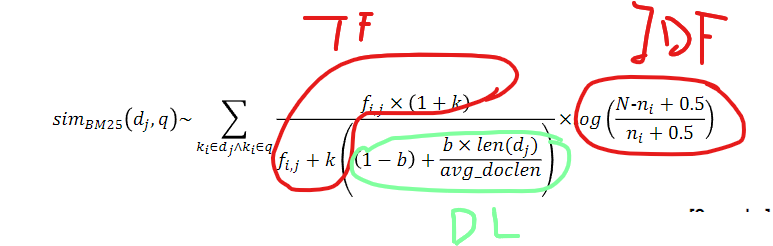

# What is information need? What are the different types of information need? (VCFC)
**Def**: The requirement to interested information of users.
1. **Visceral need (本能需求)**: the actual, but unexpressed need for information : “a vague sort of dissatisfaction ...  probably inexpressible in linguistic terms”.  
2. **Conscious need (有意识的需求)**: the conscious within-brain description of the need: “an ambiguous and rambling  statement”. i.e. “I know what I’m looking for but I don’t  know how to say it”.  
3. **Formalised need (正式需求):** the formal statement of the question   
4. **Compromised need (折衷需求): t**he question as presented to the information system

# 分辨文档是否有phrase
### 注意事项：
- phrase中关键词出现次数和间隔
- phrase中关键词位置（是否在第一个等）
### Example(23Q1.b)
Which document(s) could contain the phrase “the same day at the same time”
```
<same: 41825;
1: 120, 124, 167;
2: 9, 10, 13;
3: 121, 162;
4: 4, 101, 105, 106;
5: 1, 5, 88, 888, 889;
...>
```

- 答案：1
- 原因：
    先看same在phrase中出现位置：相隔三个单词，145都符合，但4中106也是same，phrase中没有相邻same，4排除。5中第一个same在句首，不符合phrase中same位置，5排除。

# 解释Boolean searches, simple ranking and reranking based on machine learning为什么对IR系统重要
- **Boolean search**: Very quick initial select, narrow massive data by using boolean operators **(AND/OR/NOT**).
- **Simple ranking** (BM25):  Also fast, perform Light weight & Simple but Effective Ranking,
- **Reranking based on machine learning**: Slow, reorders the top-*k* BM25 results using machine learning.

# BM25三个principles
- Term Frequency (**TF**): A way of ranking how important term is in a document collection.
- Inverse Document Frequency (**IDF**): Count of the number of times the term appears in the document.
- Document length: BM25 normalises the length of document in calculations.


# Stemming and Lemmatisation定义，Adv & Disadv 
| **Technique**       | **Definition**                                                                 | **Advantages**               | **Disadvantages**              | **Example**                      |
|---------------------|-------------------------------------------------------------------------------|------------------------------|--------------------------------|----------------------------------|
| **Stemming**        | Process of reducing words to their root form                                  | Fast processing             | May overstem (cut too much)    | "computing", "computer" → "comput" |
| **Lemmatization**   | NLP technique that converts words to their base/dictionary form (lemma)       | More effective               | Slower processing             | "running" → "run"                |

# Cranfield Paradigm
The **Cranfield Paradigm** is a foundational experimental methodology in information retrieval that provides a standardized framework for evaluating retrieval systems. It involves:

1. A standard corpus used for all queries
2. A set of standard queries
3. A set of relevance judgements

Its advantages include repeatability, objectivity, and efficiency.

# 非英语中tokenising会遇到的问题
**French:** L'ensemble → one token or two?

**German**: German noun compounds are not segmented

**Chinese and Japanese** have no spaces  between words

**Arabic** is basically written right to left, but with certain  items like numbers written left to right.

# 为什么representation对IR很重要？
>Information retrieval is defined as dealing with the “representation, storage, organization
>of, and access to information items”

- **Storage** and **Organisation**: There are important  considerations in terms of storing documents also. They  must be organised so as to be **quickly accessible**. This is  particularly important with large document collections.  
- **Access**: The key attribute of an IR system is to allow users  to access the information in question. This should happen in a timely and efficient manner.
- **Representation**: Represent textual documents in mathematical form so retrieval is faster.

# Adversarial Information Retrieval是什么，举两个例子（MHCSED）
**Def**: Violating search engine guidelines and rules to try and get an artificial advantage: 

| **Technique**             | **Definition**                                               | **Purpose**                                                  |
| :------------------------ | :----------------------------------------------------------- | :----------------------------------------------------------- |
| **Meta Tags Abuse**       | Manipulating `<meta>` tags (e.g., keyword stuffing) for early search engines. | Artificially boost visibility for targeted searches.         |
| **Hidden Text**           | Concealing keywords via CSS/font color matching background.  | Inflate term frequency (TF) without user visibility.         |
| **Cloaking**              | Serving different content to crawlers (e.g., via User-Agent detection). | Trick crawlers into indexing keyword-rich content while users see normal pages. |
| **JavaScript Deception**  | Using `<noscript>` or JS redirects to show hidden text to crawlers. | Get crawlers to index hidden keywords while redirecting users. |
| **PageRank Exploitation** | Creating link farms or comment spam for artificial backlinks. | Manipulate PageRank scores to improve rankings.              |
| **Doorway Pages**         | Creating multiple optimized pages for different queries, all funneling to one target. | Maximize keyword coverage while avoiding on-page keyword dilution. |

